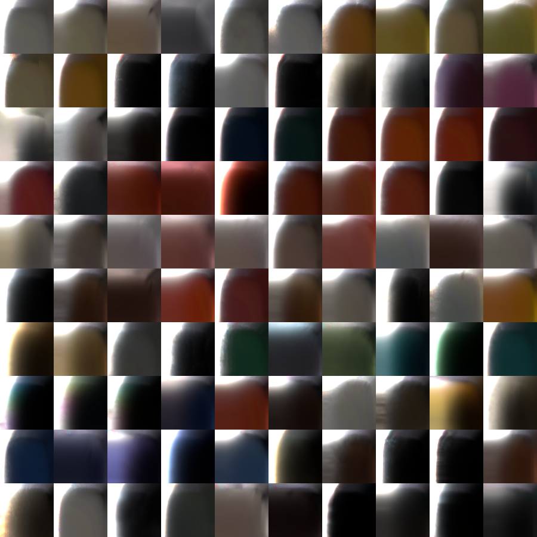
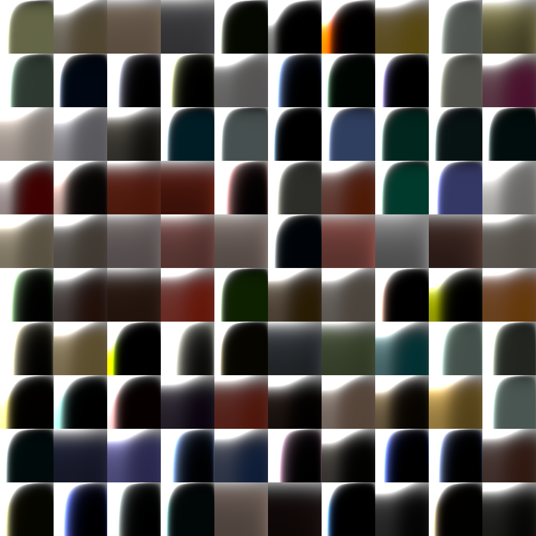
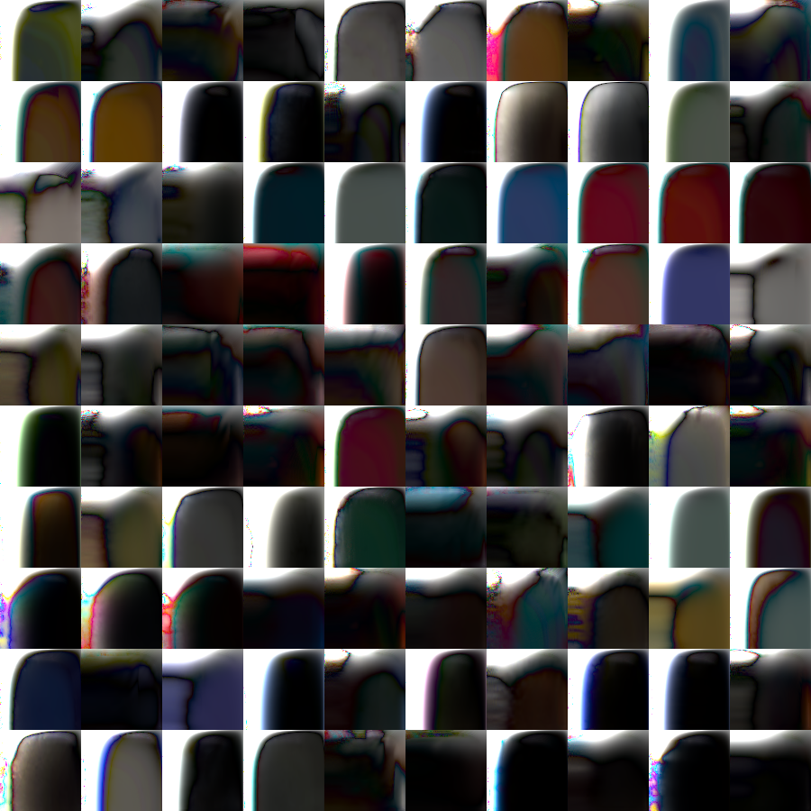

# glTF material model implementation in SymPy

This implementation of the glTF material model can be used to fit the glTF material model[2] to measurement data. With SymPy code generation, the material model can also be exported as a C-like implementation suitable for C/C++ implementations as well as GPU implementations with Hlsl/Glsl.

## Features

This repository contains an implementation of the glTF physically based material model in SymPy as well as code to fit the model to measurement data such as the Merl 100 BRDFs[1].

The basic implementation of glTF is limited with only 3 parameters (base_color, roughness, metallic). This implementation also supports fitting the index of refraction using KHR_materials_ior. An overview of the implemented glTF features:

- [x] basic metallic-roughness glTF pbr model
- [x] KHR_materials_ior: custom index of refraction
- [ ] KHR_materials_clearcoat: materials with a clearcoat
- [ ] KHR_materials_specular: custom specular factor
- [ ] KHR_materials_iridescence: iridescent materials
- [ ] KHR_materials_sheen: cloth and fabric material
- [ ] KHR_materials_transmission : transmissive materials
- [ ] KHR_materials_volume: homogeneous non-scattering media
- [ ] KHR_materials_dispersion: dispersing media

## Usage

### Materials

To use the fitted material in your 3D file, simply copy the content of `results/materials.json` into the glTF file and reference the materials by their name within the Scene's geometry.

### Executing the fitting code

Set up a python environment with suitable requirements installed e.g. using conda:

    conda create --name <env> --file requirements.txt

Download the Merl 100 BRDF from here: https://zenodo.org/records/8101681/files/BRDFDatabase.zip?download=1 and unzip it into the folder `merl100/` (the directoy structure should look `<this_repo>/merl100/brdfs/<brdf>.binary`)

Then execute the fitting notebook `fit_glTF.ipynb` to generate the `results/materials.json` and `results/{merl|glTF|error}_slices.png` files.

# Results

The fitted material slices ($\phi_d=90°$) are shown side by side here:

Merl Data:

glTF fits:

Absolute difference between model and data:

# References:

- [1] Matusik, W., Pfister, H., Brand, M., McMillan, L., "A Data-Driven Reflectance Model", ACM Transactions on Graphics (TOG), DOI: 10.1145/​882262.882343, Vol. 22, No. 3, pp. 759-769, July 2003.
- [2] glTF 2.0 specification https://registry.khronos.org/glTF/specs/2.0/glTF-2.0.html#appendix-b-brdf-implementation
- [3] glTF 2.0 extension registry https://github.com/KhronosGroup/glTF/tree/main/extensions
- [4] Burley, Brent, and Walt Disney Animation Studios. "Physically-based shading at disney." Acm Siggraph. Vol. 2012. No. 2012. vol. 2012, 2012. https://disneyanimation.com/publications/physically-based-shading-at-disney/